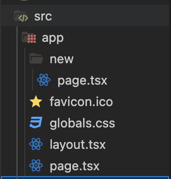

# Server Actions Demonstration
This project demonstrates  Get and Post methods to a PostgreSQL database using Next.js 13's server actions, using Prisma as an ORM.

## Installation Setup

- _**Installing Next.js 13.4:**_
    - In your terminal, run ```npx create-next-app@latest``` to install the latest version of Next.js
       - TypeScript: yes
        - Tailwind CSS: yes
        - ES Lint: yes
        - SRC Directory: yes
        - App Router: yes

- _**Installing Prisma:**_
    - In your terminal run ```npm install typescript ts-node @types/node --save-dev```
    - Run ```npm install prisma --save-dev```
    - Run ```npm i @prisma/client```
    - Finally, install the Prisma CLI as a development dependency in the project. ```npx prisma init```

    - After those commands are completed, you should have a "prisma" folder at the root level of the directory.  Inside of the "prisma" folder you will have a file named "schema.prisma"
        - An .env file should have also been created when prisma was installed.

- _**Provisioning PostgreSQL through Railway:**_
    - Go to https://railway.app/ and create an account for free.  (You get up to 500 hours of DB run time per month for free).  
    - Click on "Dashboard" once signed in and then "+ new project." Select "provision PostgreSQL Database" and then go to "connect" to get your DATABASE_URL.
    - Now copy and paste your secret DATABASE_URL into your .env file as ```DATABASE_URL="YOUR SECRET EXAMPLE_DB_URL"```
**Go into your your "gitignore" file and scroll own to "# LOCAL env files" and add ".env" to avoid posting your DATABASE_URL to your own public repository.**
```
# local env files
.env*.local
.env
```

_Run "prisma db pull" to turn your database scheme into a Prisma schema_
 
## Prisma Schema Setup
_schema.prisma file_
 - We are adding the TODO model to have all of our information about the Todo items.
```
model Todo {
  id String @id @default(uuid())
  title String
  complete Boolean
  createdAt DateTime @default(now())
  updatedAt DateTime @updatedAt
}
```
- To push the Todo model to the database, in the CLI run ```npx prisma migrate```

**Using Prisma inside of your project:**
- _Create a file inside of the src directory called **"db.ts"** and add the following code._
```
import { PrismaClient } from '@prisma/client'

const globalForPrisma = global as unknown as {
  prisma: PrismaClient | undefined
}

export const prisma =
  globalForPrisma.prisma ??
  new PrismaClient({
    log: ['query'],
  })

if (process.env.NODE_ENV !== 'production') globalForPrisma.prisma = prisma
```

## Creating a Route
- Inside of the "app" directory, create a folder called "new".  This will be our first route for our todo list for us to create a new Todo. Inside of the "new" folder, create a **_page.tsx_** file.  Everything added the page.tsx file will route to the /new route.  We will be creating a new Todo inside of this route. _example: http://localhost:3000/new_



**At the root level of the "app" directory, there is another page.tsx file.  Inside of this file is where we will get our Todos, and update Todos.**


**Here is an basic example of creating a todo in with prisma to the PostgreSQL DB**

```
import { prisma } from "@/db"
import Link from 'next/link'

export default async function Home() {

  const todos = await prisma.todo.findMany()
  await prisma.todo.create({ data: { title: "test", complete: false }})
  

  return (
    <>
      <header className='flex justify-between mb-4 items-center'>
        <h1 className='text-2xl'>Todos</h1>
        <Link className='border border-slate-300 text-slate-300 px-2 py-1 rounded
        hover:bg-slate-700 focus-within:bg-slate-700 outline-none' href='/new'>
          New Todos
        </Link>
      </header>
      <ul>
        {todos.map(todo =>(
          <li key={todo.id}>{todo.title}</li>
        ))}
      </ul>
      
    </>
  )
}
```
**Explanation:**
- We are importing **Prisma** into this page.tsx file to fetch Todo's from our database and to create a Todo from our database.  The **Link** component is also being imported to create a Link to the "new" page later.  For now we are testing the creation of a Todo inside of the Home page.tsx file.
- This component will be a **server component** since we are using the "app" router. We have the ability in the "app" router to run server code, and send the data to the client.  As long as there are no client actions (useEffect, useState, onChange event listeners etc...)  If make the **default function _async_** we are able to call our database anywhere in our project that we want, and only the data will be shown to the client. By doing this, we can then use prisma inside of this component to get our "test" Todo.
- After declaring the default async function, we are then intializing our todos in our database and fetching them all from prisma with ```const todos = await prisma.todo.findMany()```
- The following line is a hardcoded test for creating a new test Todo.
- In the JSX we map over our todo in a <ul> tag, and list the **id** and **title** from the Todo Schema.  This will display our Todo with the **id** and **title** in the front end now.


## <TodoItem /> Client Component
- Inside of the "src" folder create a new folder called "components", and inside of the components folder create a new file called _**Todoitem.tsx**_
- In this TodoItem component, we're creating an input for a checkbox of a Todo item, with some additional Tailwind CSS to give a given checked Todo a line through with a darker color once checked to signify completion of that specific Todo.  Since we are using client interactivity (checkbox) this will be a client component.  To signify we write 'use client' at the top of the component.
```
'use client'

type TodoItemProps = {
    id: string
    title: string
    complete: boolean
}

export function TodoItem({ id, title, complete, toggleTodo}: TodoItemProps) {
    return <>
    <li className="flex gap-1 items-center">
        <input id={id} type="checkbox" className="cursor-pointer peer" />
        <label htmlFor={id} 
        className="cursor-pointer peer-checked:line-through
        peer-checked:text-slate-500"
        >
            {title}
        </label>
    </li>
    </>
}

```
- **This is what you should see in your front end.**

- To update our page.tsx file the app directory with the new properties added in **TodoItem.tsx**, we will update the code with the following.
```
import { prisma } from "@/db"
import Link from 'next/link'
import { TodoItem } from '@/components/TodoItem'

export default async function Home() {

  const todos = await prisma.todo.findMany()
  await prisma.todo.create({ data: { title: "test", complete: false }})
  

  return (
    <>
      <header className='flex justify-between mb-4 items-center'>
        <h1 className='text-2xl'>Todos</h1>
        <Link className='border border-slate-300 text-slate-300 px-2 py-1 rounded
        hover:bg-slate-700 focus-within:bg-slate-700 outline-none' href='/new'>
          New Todos
        </Link>
      </header>
      <ul>
        {todos.map(todo =>(
          <TodoItem key={todo.id} {...todo}/>
        ))}
      </ul>
      
    </>
  )
}
```
## New Todos
**In this component we will create a form for creating a new Todo, and explore using a server action for toggling & updating a todo.**
  - To add a new Todo we must first create a <form> tag inside of the component. The input="text" and name="title".  We also add some Tailwind CSS classNames to add some basic styling.
  - Additionally inside of the <form> tag, we are adding a <div> with a **_"cancel"_** <Link> tag inside to go back to the Homepage, and a <button> for submitting our form and eventually pushing the Todo to our Database.  **_Currently our form is "submitting", but it has not been hooked up to any server action yet, so it currently is not completed._**
  ```
  export default function Page() {
  return (
  <>
    <header className="flex justify-between items-center mb-4">
        <h1 className="text-2xl">New</h1>
    </header>
    <form className="flex gap-2 flex-col">
        <input type='text' name="title" className="border border-slate-300
        bg-transparent rounded px-2 py-1 outline-none
        focus-within:border-slate-100" 
    />
    <div className="flex gap-1 justify-end">
        <Link href=".." className="border border-slate-300 text-slate-300 px-2 py-1 rounded
        hover:bg-slate-700 focus-within:bg-slate-700 outline-none"
        >
            Cancel
        </Link>
        <button type="submit" className="border border-slate-300 text-slate-300 px-2 py-1 rounded
        hover:bg-slate-700 focus-within:bg-slate-700 outline-none"
        >
            Create
        </button>
    </div>    
    </form>
  </>
  )
}
  ```
## Creating a Server Action for our Todo Form
- To start creating a server action in our "new" component, we must create an async function.  We'll call this function **createTodo**, and everything getting passed to this function is a form of data.  In our case it will be "FormData". In order to make this function a "server action" we must add _**"use server"**_ in the top of the function to declare it as such.
  - This function is explicitly server code, and will never run on the client.
```
async function createTodo(data: FormData) {
    "use server"
    console.log("Test")
}
```
The above code **will not** run until the experimental server actions option is enabled in the _Next.config.js_ file
```
/** @type {import('next').NextConfig} */
const nextConfig = {
    experimental: {
        serverActions: true,
    }
}

module.exports = nextConfig

```
- Once these steps are complete, we are ready to use the server action.  To use the server action, add **```action={createTodo}``` inside of the <form> tag.  Now when we submit our form, it is going to call our server action, and for now will log our "test" console.log statement inside of the IDE Terminal and not in our browser console, since it is **NOT** a client component.

- To get our data for our Form title, we pass along the name of the input we want to get. The title has a type of **string | Object | undefined.**. We will create a check to make sure that we recieve a string, and if we do not receive a string, or we recieve an undefined value we will throw an error.
- Then we will use Prisma to create a new Todo, and after submitting, we will redirect to the home page that displays our Todos.  
```
import { prisma } from "@/db";
import { redirect } from "next/navigation";

async function createTodo(data: FormData) {
    "use server"

    const title = data.get("title")?.valueOf()
    if(typeof title !== "string" || title.length === 0) {
        throw new Error("Invalid Title")
    }

    await prisma.todo.create({ data: { title, complete:
         false } })
    redirect("/")
}
```
## Finshing up
- In order to have our checkmarks reflect in our database we need to set up an onChange in our <TodoItems> component.  The TodoItem.tsx file should be updated with the following.
```
export function TodoItem({ id, title, complete, toggleTodo}: TodoItemProps) {
    return <>
    <li className="flex gap-1 items-center">
        <input id={id} type="checkbox" className="cursor-pointer peer" 
        defaultChecked={complete}
        onChange={e => toggleTodo(id, e.target.checked)}
        />
        <label htmlFor={id} className="cursor-pointer peer-checked:line-through
        peer-checked:text-slate-500">
            {title}
        </label>
    </li>
    </>
}
```
As you can see above, we have added ```defaultChecked={complete}```, and ```onChange={e => toggleTodo(id, e.target.checked)}```
 - The "complete" value comes from our ***TodoItemProps*** and returns as a boolean value.
 - The onChange allows us to toggle our Todos, and we will pass in a ***toggleTodo***, and add it to our ***TodoItemProps***
```
type TodoItemProps = {
    id: string
    title: string
    complete: boolean
    toggleTodo: (id: string, complete: boolean) => void
}
```
- Now we will pass toggleTodo to our **<TodoItems />** inside of the ***page.tsx*** file in the app directory.
```
import { prisma } from '@/db'
import Link from 'next/link'
import { TodoItem } from '@/components/TodoItem'

function getTodos() {
  return prisma.todo.findMany()
}

export default async function Home() {

  const todos = await getTodos()
  

  return (
    <>
      <header className='flex justify-between mb-4 items-center'>
        <h1 className='text-2xl'>Todos</h1>
        <Link className='border border-slate-300 text-slate-300 px-2 py-1 rounded
        hover:bg-slate-700 focus-within:bg-slate-700 outline-none' href='/new'>
          New Todos
        </Link>
      </header>
      <ul>
        {todos.map(todo =>(
          <TodoItem key={todo.id} {...todo}  toggleTodo={toggleTodo}/>
        ))}
      </ul>
      
    </>
  )
}

```
- **Finally we want to run code the server using another server action inside of an async function called "toggleTodos".**
```
async function toggleTodo(id: string, complete: boolean) {
  "use server"

await prisma.todo.update({ where: { id }, data: { complete } })
}
```
**Since we are using an event handler inside of the <TodoItem> component, the component must be a client component.  At the top of the _TodoItem.tsx_ add in** ```'use client'```.  
